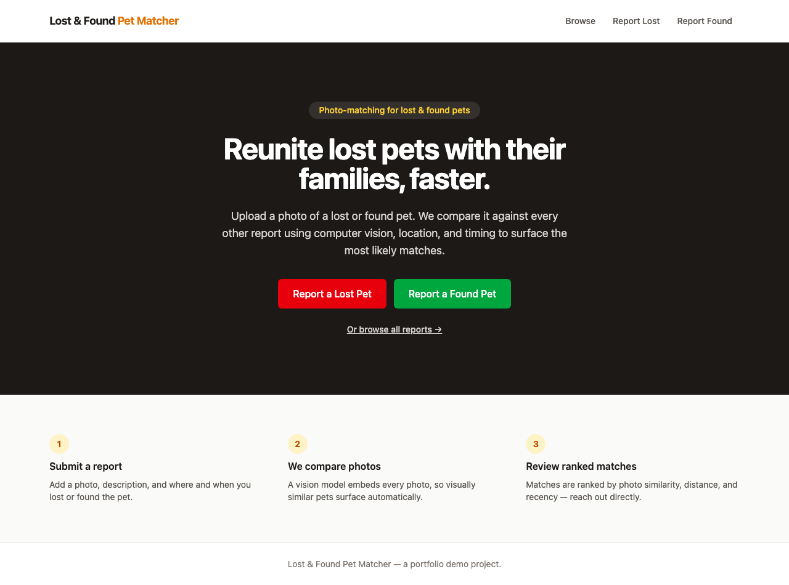
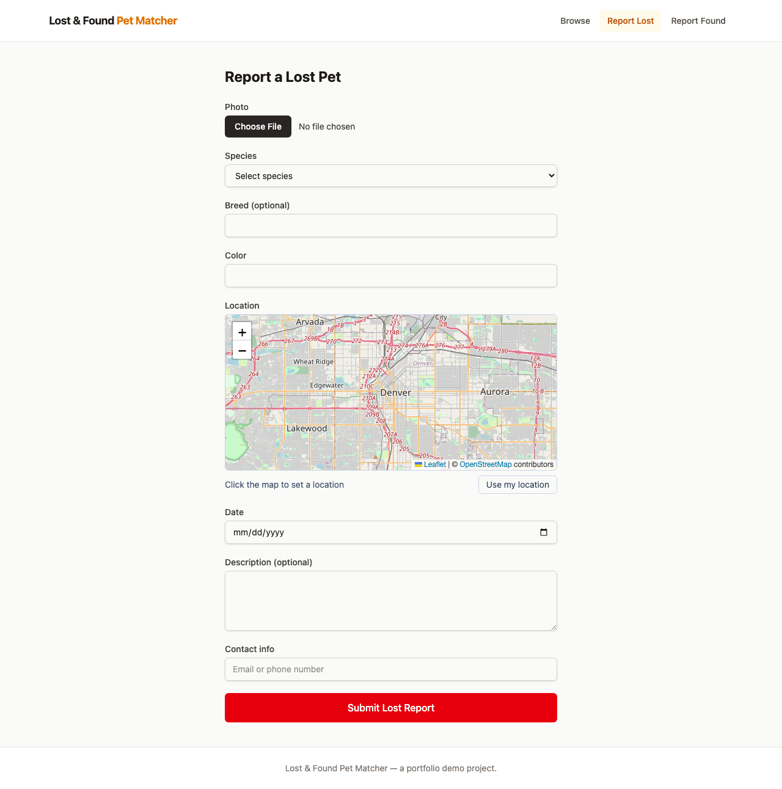
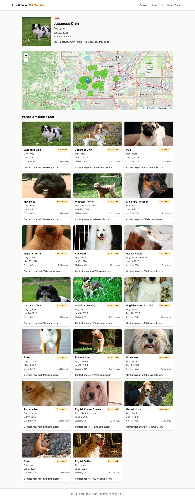

# Lost & Found Pet Matcher

Report a lost or found pet with a photo, and let computer vision do the searching. The
backend embeds every uploaded photo with CLIP, stores the vector in Postgres via pgvector,
and ranks candidate matches by blending visual similarity with geographic proximity and
recency — so instead of scrolling through hundreds of "found dog" posts, you get a short,
ranked list of the ones that actually look like your pet, nearby, around the right date.

**Live demo:** _TODO — add the deployed URL here after deploying (see "Deploying to
Render" below)._

## Screenshots

| | |
|---|---|
|  |  |
| Landing page | Report form — click-to-pick location on the map |
|  |
| Results — map + ranked candidate grid | Browse — filter by type/species/location |

## Architecture

```
┌──────────────────────────────────────────────────────────┐
│ React SPA — Vite + TypeScript + Tailwind + react-leaflet │
│ dev build  -> Vite dev-server proxy                      │
│ prod build -> nginx                                      │
└──────────────────────────────────────────────────────────┘
            | /api requests (same-origin proxy)
                             v
┌────────────────────────────────────────────────────┐
│ FastAPI backend                                    │
│ CLIP (open_clip, ViT-B-32) — runs in-process       │
│                                                    │
│ POST/GET /api/reports        GET /api/reports/{id} │
│ GET /api/reports/{id}/matches                      │
│ GET /api/images/*   (StaticFiles)                  │
└────────────────────────────────────────────────────┘
                          |
                 v  async SQLAlchemy
┌─────────────────────────────────────┐
│ PostgreSQL 16 + pgvector            │
│ reports  /  report_embeddings       │
│ (vector(512), ivfflat cosine index) │
└─────────────────────────────────────┘

Backend also reads/writes report photos and the CLIP weight cache directly on:
┌───────────────────────────────────────────┐
│ Persistent volume / disk                  │
│ /data/images   (uploaded + seeded photos) │
│ /data/hf-cache (CLIP weight cache)        │
└───────────────────────────────────────────┘
```

## Tech stack

- **Backend:** Python 3.11, FastAPI, SQLAlchemy 2.0 (async), Pydantic v2, Alembic
- **Embeddings:** `open_clip_torch`, ViT-B-32, 512-dim vectors, CPU inference
- **Database:** PostgreSQL 16 + [pgvector](https://github.com/pgvector/pgvector) (ivfflat cosine index)
- **Frontend:** React 19, Vite, TypeScript, Tailwind CSS v4, react-router-dom, react-leaflet
- **Infra:** Docker + Docker Compose (dev and prod configs), nginx (prod static serving + reverse proxy), Render (deploy target)

## Key features

- **CLIP-based visual matching** — every report photo is embedded once at upload time and
  compared against candidates via pgvector's cosine-distance operator, not a naive
  pixel/hash comparison.
- **Blended ranking, not just similarity** — matches are scored from three components
  (visual similarity, distance, recency), each independently tunable via query params —
  see "How matching works" below.
- **Deliberately-planted "obvious pairs" in the seed data** — the seed script reuses the
  same source photo for a `lost` and a `found` report (different coordinates/dates), so
  there are guaranteed real matches to demo, not just noise.
- **Map-based location picking** (`react-leaflet` + OpenStreetMap tiles, no API key)
  everywhere a location is needed: reporting a pet, filtering the browse page, and
  visualizing ranked matches by distance and score on the results page.
- **Server-side geospatial filtering** — the browse page's radius filter and the matching
  endpoint's candidate search both filter in SQL (haversine formula), not by fetching
  everything and filtering in JavaScript.

## Local development

Requires Docker (or a Docker-compatible engine — this was built and tested against
[Colima](https://github.com/abiosoft/colima) on an Intel Mac, no Docker Desktop needed).

```bash
cp .env.example .env   # optional — compose has working defaults without it
docker compose -f docker/docker-compose.yml up --build
```

- Frontend: http://localhost:5173
- API: http://localhost:8000 (interactive docs at `/docs`)
- Postgres: localhost:5432

Apply the database schema (first run only):

```bash
docker compose -f docker/docker-compose.yml exec api alembic upgrade head
```

Run the backend tests:

```bash
docker compose -f docker/docker-compose.yml exec api pytest
```

### Seeding demo data

Populates the database with synthetic lost/found reports (with real CLIP embeddings) from
the [Oxford-IIIT Pet Dataset](https://www.robots.ox.ac.uk/~vgg/data/pets/), so the app
isn't empty and there's something for the matching algorithm to actually match against.

1. Download the dataset and place it under `data/` at the repo root:

   ```
   data/
   ├── images/                    # Abyssinian_1.jpg, yorkshire_terrier_12.jpg, ...
   └── annotations/
       └── list.txt                # filename -> species/breed mapping
   ```

   ([images.tar.gz](https://www.robots.ox.ac.uk/~vgg/data/pets/data/images.tar.gz),
   [annotations.tar.gz](https://www.robots.ox.ac.uk/~vgg/data/pets/data/annotations.tar.gz) —
   extract both into `data/`.)

2. With the stack running (`data/` is mounted read-only into the `api` container at
   `/data/source`), run:

   ```bash
   docker compose -f docker/docker-compose.yml exec api python scripts/seed.py --limit 500
   ```

   `--limit` is the total number of reports to create. About 15-20% are deliberately
   planted as "obvious pairs" (see "Key features" above). `--reset` truncates and re-seeds
   cleanly for local iteration; `--lat`/`--lon` change the demo city center (default:
   Denver, CO). Full flag list in `scripts/seed.py --help`.

## How matching works

`GET /api/reports/{id}/matches` finds and ranks candidates from the opposite report type
(a `lost` report matches against `found` reports, and vice versa).

**Filtering** happens in SQL, before any scoring — a candidate must:
- be the opposite `report_type` and the same `species`
- have `status = 'open'`
- be within `radius_km` of the source report's location (great-circle distance via the
  haversine formula)
- have an `event_date` within `date_window_days` of the source's, in *either*
  direction — people don't always file a "lost" report before the matching "found" report
  shows up, so no ordering is assumed

**Scoring** blends three 0-1 components for every candidate that survives filtering:

| Component | Formula | Notes |
|---|---|---|
| **visual** | `1 - cosine_distance` (pgvector's `<=>` operator) | CLIP embedding similarity |
| **distance** | `1 - (distance_km / radius_km)` | closer is better; 0 at the search radius edge |
| **recency** | `1 - (days_since_created / date_window_days)` | how fresh the *candidate* is, relative to now — not relative to the source report (see "Engineering decisions" below) |

```
score = w_visual · visual + w_distance · distance + w_recency · recency
```

Defaults — `radius_km=25`, `date_window_days=45`, `w_visual=0.6`, `w_distance=0.25`,
`w_recency=0.15`, `limit=20` — live in `config.py` (env vars `MATCH_*`) and are all
overridable per-request via query params:

```bash
curl "http://localhost:8000/api/reports/<id>/matches?radius_km=10&w_visual=0.8&w_distance=0.1&w_recency=0.1"
```

## Deploying to Render

The production build differs from dev in one structural way: the frontend is no longer
served by the Vite dev server. It's built to static assets and served by nginx, which also
reverse-proxies `/api/*` to the backend — so in production the browser only ever talks to
one origin, and the backend's CORS config never has to be exercised for the frontend's own
requests.

### 1. Verify the production build locally first

Before trusting this to a real deploy:

```bash
docker compose -f docker/docker-compose.prod.yml up --build
```

- Frontend (nginx, proxying `/api/*` to the backend): http://localhost:8080
- API directly: http://localhost:8000

```bash
# Apply the schema
docker compose -f docker/docker-compose.prod.yml exec api alembic upgrade head

# Confirm the whole path works: browser -> nginx -> proxied /api -> Postgres
curl http://localhost:8080/api/health
# {"status":"ok"}
```

Click through the full flow at `http://localhost:8080` exactly like you would in dev. This
uses a separate Compose project name and separate volumes (`*_prod` suffixed) from the dev
stack, so it can run alongside it without touching your dev database or seeded images.

### 2. Deploy via the Render blueprint

`render.yaml` at the repo root provisions a Postgres database and both services (API +
frontend) in one pass.

**On your side, before deploying:**
- Push this repo to GitHub — Render's blueprint flow deploys from a connected git repo, so
  it needs to exist there with real commits first.
- Create a Render account and connect it to GitHub.

**In the Render dashboard:**
1. **New +** → **Blueprint**, select this repo, point it at `render.yaml`.
2. Render provisions `petmatcher-db` (Postgres), `petmatcher-api`, and `petmatcher-frontend`.
   First build takes a while (~5-10 min) — the API image installs PyTorch.
3. **Manual steps `render.yaml` can't automate** (also documented as comments in the file
   itself):
   - **Enable pgvector**: open a Shell against `petmatcher-db` and run
     `CREATE EXTENSION IF NOT EXISTS vector;`. If it fails, the Postgres plan may need
     upgrading — extension availability has changed across Render's tiers, so check
     Render's current docs if `starter` doesn't have it.
   - **Fix the DB driver scheme**: Render's `fromDatabase` connection string is
     `postgresql://...`; this app's async SQLAlchemy engine needs
     `postgresql+asyncpg://...`. Edit `petmatcher-api`'s `DB_URL` env var in the dashboard
     and insert `+asyncpg` right after `postgresql`, then redeploy.
   - **Confirm the two service URLs**: `render.yaml` assumes
     `https://petmatcher-api.onrender.com` and `https://petmatcher-frontend.onrender.com`.
     If Render assigned different URLs (e.g. a name was taken), update `CORS_ORIGINS` on
     the API service and `API_PROXY_TARGET` on the frontend service to match, then
     redeploy both.
   - **Run the migration**: Shell into `petmatcher-api` and run `alembic upgrade head` —
     or set it as a Render **Pre-Deploy Command** on the service so it runs automatically
     on every future deploy.
   - **Seed demo data**: Shell into `petmatcher-api`. The git-based deploy doesn't include
     `data/` (it's gitignored — see "Seeding demo data" above), so download it directly
     into the running container first:

     ```bash
     mkdir -p /tmp/dataset && cd /tmp/dataset
     curl -L -o images.tar.gz https://www.robots.ox.ac.uk/~vgg/data/pets/data/images.tar.gz
     curl -L -o annotations.tar.gz https://www.robots.ox.ac.uk/~vgg/data/pets/data/annotations.tar.gz
     tar -xzf images.tar.gz && tar -xzf annotations.tar.gz
     cd /app && python scripts/seed.py --dataset-dir /tmp/dataset --limit 200
     ```

     `--limit 200` instead of 500 keeps a live demo lighter — plenty of data to show real
     ranked matches without a multi-minute seed run on every fresh deploy.

### Env vars / secrets reference

None of these belong in a committed file — `render.yaml` either sets safe non-secret
defaults directly or points Render at values it manages itself (`fromDatabase`). Values you
may need to adjust by hand in the Render dashboard:

| Var | Where | Notes |
|---|---|---|
| `DB_URL` | petmatcher-api | Auto-filled from the database; needs `+asyncpg` inserted manually (see above) |
| `CORS_ORIGINS` | petmatcher-api | Must match the frontend's actual deployed origin |
| `API_PROXY_TARGET` | petmatcher-frontend | Must match the API's actual deployed origin |
| `MATCH_*` | petmatcher-api | Matching algorithm defaults — tune freely, no redeploy needed to experiment via query params instead |

### What persists, and how

Render web services only support one attached persistent disk each. `petmatcher-api`
mounts a single disk at `/data`, covering both `/data/images` (uploaded/seeded photos) and
`/data/hf-cache` (the CLIP weight cache — see "Engineering decisions" below). Without this
disk, both would be wiped on every deploy/restart: uploaded photos would 404, and every
cold start would re-download ~350MB of CLIP weights before serving its first request.

## Engineering decisions worth knowing about

A few real issues that came up during the build, and how they were resolved — more useful
to a reviewer than a plain feature list.

**Test suite was silently wiping the dev database.** The pytest fixture for
`test_reports.py` creates tables and drops them at teardown. Early on, it ran against the
same database the dev API was using — so running the test suite deleted every report the
API had ever created, no warning, no error. Fixed by provisioning a dedicated
`<db>_test` database (created automatically via a Postgres init script) and overriding
FastAPI's `get_db` dependency in tests so they physically cannot reach the dev database,
regardless of what `DB_URL` happens to be set to.

**A Postgres restart silently broke the API.** After a `docker compose` change forced
Postgres to recreate, the API kept serving `connection is closed` errors instead of
reconnecting. SQLAlchemy's async engine wasn't validating pooled connections before
reusing them. Fixed with `pool_pre_ping=True` — a one-line change, but it's the difference
between "briefly degraded" and "requires a manual restart" when the database bounces.

**Client-side radius filtering would have quietly broken pagination.** The browse page
needed both a location-radius filter and real pagination. Filtering by distance in
JavaScript after fetching a page from the database is wrong: page 2 of an unfiltered query
isn't page 2 of the filtered results. The radius filter had to be pushed into the same SQL
query as the `LIMIT`/`OFFSET`, using the same haversine formula as the matching endpoint,
expressed via SQLAlchemy's `func.*` so it composes with the existing query builder instead
of needing raw SQL.

**Every fresh container re-downloaded CLIP's weights.** ~350MB re-fetched from Hugging
Face Hub on every container recreation (measured: 10s warm start vs. 33s cold, in a fast
network environment — worse on a slow one, and worse still on every Render deploy).
`HF_HOME` now points at a path backed by a persistent volume/disk in every environment,
so the weights download exactly once.

**Report photos had no way to reach the browser.** `report.image_path` is a server-side
filesystem path (`/data/images/xxx.jpg`) — there was no HTTP route serving it at all until
the results/browse pages needed to actually show photos, at which point "the feature is
simply impossible" forced adding a `StaticFiles` mount at `/api/images`.

**Docker Compose silently reused a stale anonymous volume.** After adding `react-leaflet`
as a new frontend dependency, rebuilding the frontend image didn't pick it up — Compose
preserves anonymous volumes (the `node_modules` bind-mount-shadow trick) across container
recreation by default, so the *old*, dependency-less volume got reused instead of the
freshly-built image's `node_modules`. Fixed by explicitly removing the volume. Worth
knowing: any time a frontend dependency changes, that volume needs to go too, or the new
package silently won't be there.

## What I'd do next

- **S3-compatible object storage** instead of local disk for images — the natural next
  step now that the app runs on a platform where local disk isn't guaranteed to persist
  across scaling events; the storage layer (`app/services/storage.py`) was already written
  as a thin, swappable module in anticipation of this.
- **Breed auto-detection** from the photo at upload time (CLIP zero-shot classification
  against a breed label set), pre-filling the breed field instead of requiring manual entry.
- **Relevance feedback** — let a reporter mark a suggested match as "not my pet," and feed
  that back into ranking (or at minimum, suppress it from future results for that report).
- **Notifications** — email/SMS when a new report scores above some threshold against an
  existing open report, instead of requiring someone to come back and check.
- **Multi-photo reports** — average or max-pool embeddings across multiple angles of the
  same pet, which should meaningfully improve match quality over a single photo.
